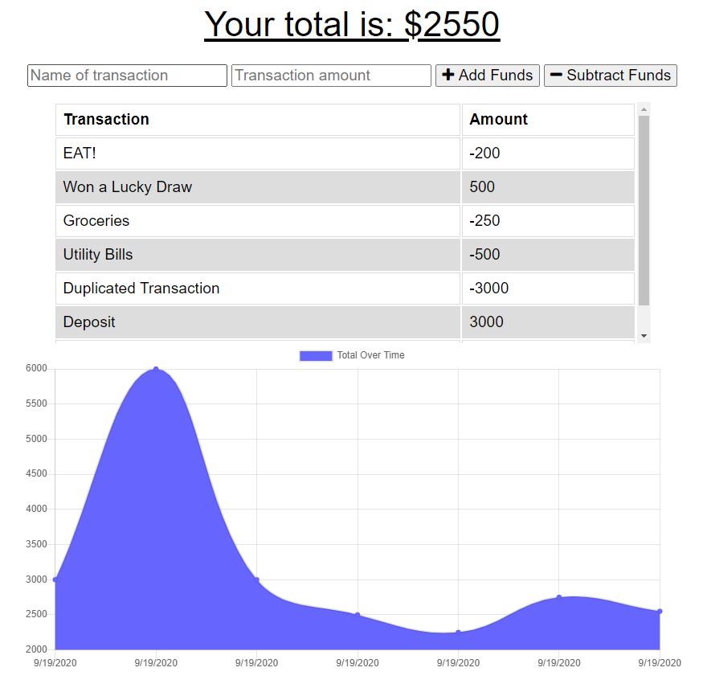
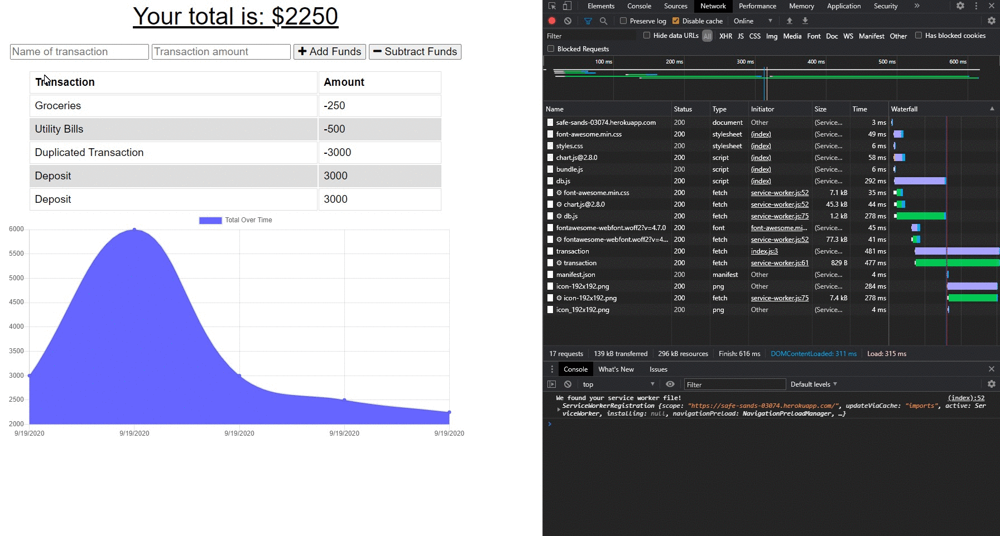
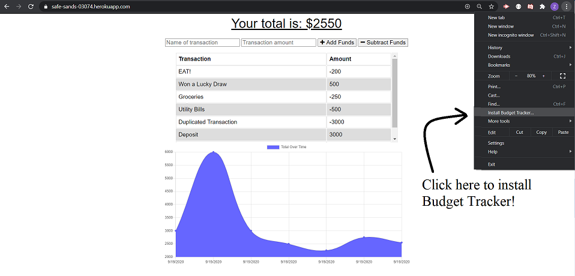

# Budget Tracker
## Description

A progressive web application (PWA) that allows users to track expenses and deposits online/offline. Transactions entered offline will be calculated and populated when a connection is established.

[](https://opensource.org/licenses/MIT)


## Installation

```
npm install
```

## Usage

### Two Ways to access the application:
1. Click [here](https://safe-sands-03074.herokuapp.com/) to launch the application
2. Run "node server.js" or "npm start" in the terminal, then the port of the localhost server will appear. Be sure to navigate to the project folder before doing so

### How To Use
1. Enter the name and amount of the transaction
2. Click "Add Funds" or "Subtract Funds" buttons to input and record transactions

### Screenshots


#### Budget Tracker is DOWNLOADABLE!


## License

License for this project: MIT

## Contributing

1. Fork/Clone this repo
2. Hack away!
3. Create a new pull request
4. Good commits will be accepted


## Questions

If you have any questions/doubts, feel free to contact me via:
* GitHub: [https://github.com/ZanHong](https://github.com/ZanHong)
* Email: [mokzanhong92@hotmail.com](mailto:mokzanhong92@hotmail.com)
